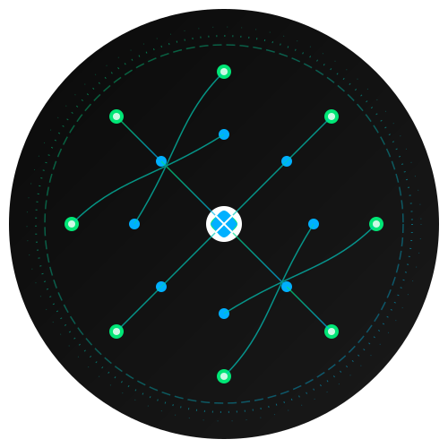

# GreenAI Project

<div align="center">

</div>

A decentralized platform that combines AI-powered meme generation with environmental action tracking on the Solana blockchain.

## Overview

GreenAI is an innovative platform that encourages environmental consciousness through the creative use of AI-generated memes and blockchain technology. Users can create memes about environmental issues, track their environmental actions, and earn rewards for their positive impact.

## Key Features

- AI-powered meme generation focused on environmental themes
- Environmental action tracking and verification
- Solana blockchain integration for transparent reward distribution
- NFT minting for verified environmental actions
- Community engagement through meme sharing and voting
- Real-time impact visualization

## System Architecture

The project follows a modern microservices architecture:

- **Frontend**: React.js with TypeScript
- **Backend**: Node.js with Express and TypeORM
- **Smart Contracts**: Solana (Rust)
- **Database**: PostgreSQL
- **File Storage**: IPFS
- **AI Services**: OpenAI GPT-4 and DALL-E

## Technical Stack

### Frontend
- React.js 18+
- TypeScript
- Redux Toolkit
- TailwindCSS
- Web3.js

### Backend
- Node.js
- Express.js
- TypeORM
- PostgreSQL
- JWT Authentication

### Blockchain
- Solana
- Anchor Framework
- Rust

### DevOps
- Docker
- GitHub Actions
- AWS (ECS, RDS, S3)

## Getting Started

1. Clone the repository:
   ```bash
   git clone https://github.com/GreenAIxyz/GreenAI.git
   cd GreenAI
   ```

2. Install dependencies:
   ```bash
   npm install
   cd apps/frontend && npm install
   cd ../backend && npm install
   ```

3. Set up environment variables:
   ```bash
   cp .env.example .env
   ```

4. Start the development environment:
   ```bash
   docker-compose up
   ```

## Core Features

### Meme Generation
- AI-powered meme creation using environmental themes
- Custom template support
- Text-to-image generation
- Style transfer options

### Environmental Action Tracking
- Action verification system
- Impact calculation
- Progress tracking
- Reward distribution

### Blockchain Integration
- Smart contract interaction
- NFT minting
- Token rewards
- Transaction history

## Contributing

Please read our [Contributing Guidelines](CONTRIBUTING.md) for details on our code of conduct and the process for submitting pull requests.

## License

This project is licensed under the MIT License - see the [LICENSE](LICENSE) file for details.

## Links

- Website: [https://www.greenai.work](https://www.greenai.work)
- Twitter: [@greenaiwork](https://x.com/greenaiwork)

Built with 💚 by the GreenAI Team 